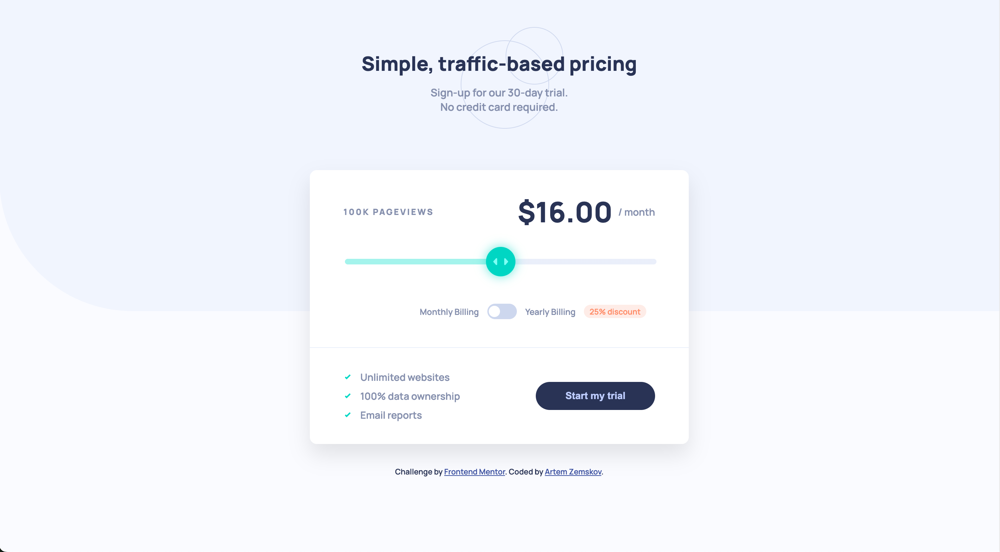

# Interactive pricing component

This is a solution to the [Interactive pricing component challenge](https://www.frontendmentor.io/challenges/interactive-pricing-component-t0m8PIyY8) on Frontend Mentor.

## Overview

Users can:

- View the optimal layout for their device (mobile & desktop)
- Move a slider to change the number of pageviews and the price
- Toggle between monthly and yearly billing (25% discount)
- See hover and focus states for all interactive elements

## Built with

- Semantic HTML5
- CSS (Flexbox, Grid, custom range input, responsive layout)
- Vanilla JavaScript

### Links

- Solution URL: [Frontend Mentor](https**://www.frontendmentor.io/solutions/interactive-pricing-component-using-flexbox-and-javascript-gOm0dd1u0h)
- Live Site URL: [GitHub Pages](https://artzemskov.github.io/interactive-pricing-component/)
